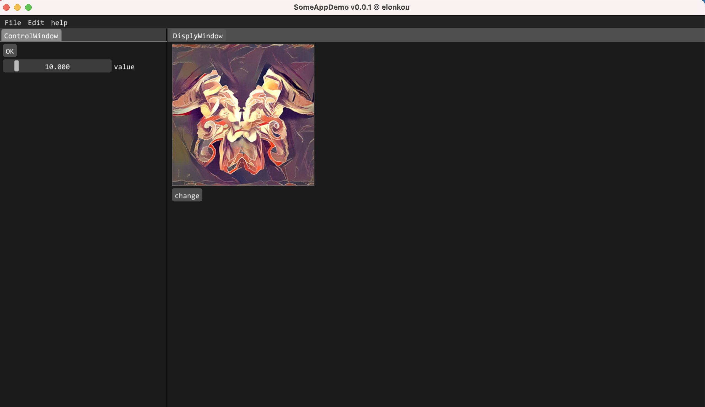
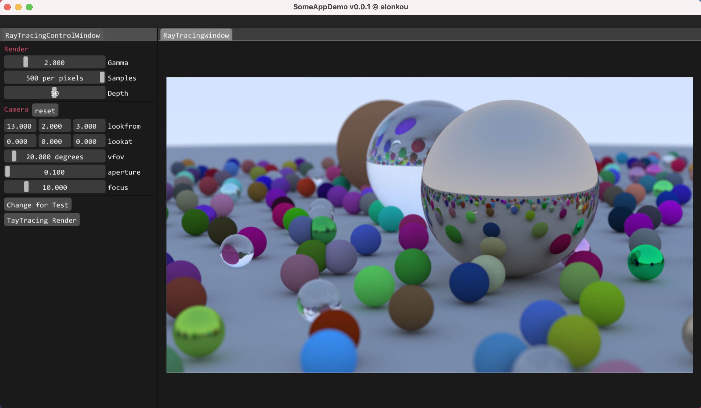

# App
> AppBase is a computer graphics framework for Linux/OSX.

App Demo


Physics2D Demo


RayTracing Demo


View3D Demo


## insatll

```bash
# insatll requirements.
sudo apt-get install build-essential
sudo apt-get install cmake libglfw3 libglfw3-dev libglew-dev libglm-dev

# MacOS (M1) (not-tested)
brew install glfw3 glew

# clone repo
git clone https://github.com/ElonKou/App.git --recursive

# compile & run
.run.sh

# manuel compile
```